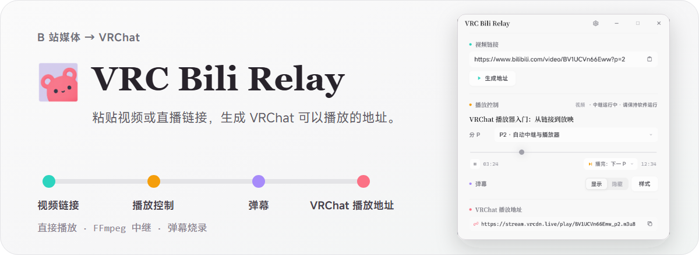

<p align="center">
  
</p>

<p align="center">
  <a href="https://github.com/Rizumu85/rizum-vrc-bili-relay/releases/latest"></a>
  
  <a href="./LICENSE"></a>
</p>

<p align="center">
  <a href="https://github.com/Rizumu85/rizum-vrc-bili-relay/releases/latest"><strong>下载 Windows x64 便携版</strong></a>
</p>

## 它是什么

VRC Bili Relay 是一个免安装的 Windows 小工具。粘贴链接以后，软件会判断媒体能否直接交给 VRChat 播放；不能直接播放时，再通过 FFmpeg 处理并推送到外部中继服务。

这个软件负责解析、转码和推流，不提供云端带宽。需要中继的时候，仍然要准备一个可用的 [VRCDN](https://vrcdn.live/) 配置，或者提供同类能力的推流服务。

## 什么时候需要推流服务

公开、稳定并且与 VRChat 兼容的 H.264/AAC 媒体可以直接返回，不会使用 VRCDN。

B 站临时媒体地址、FLV、弹幕烧录以及其他需要转码的内容需要中继。这些情况需要准备：

- RTMP 或 RTMPS 推流地址；
- 推流密钥；
- VRChat 可以访问的完整播放地址。

软件目前按照 VRCDN 的使用流程完成验证。设置页允许填写自定义服务器和播放地址，但其他服务需要自行确认推流协议、播放格式和公网可访问性。

## 下载与使用

1. 从 [Releases](https://github.com/Rizumu85/rizum-vrc-bili-relay/releases/latest) 下载 Windows x64 便携包。
2. 完整解压 ZIP，不要单独移动主程序或删除 `relay-worker.exe`、`assets` 文件夹。
3. 运行 `VRC-Bili-Relay.exe`，粘贴链接并生成地址。
4. 把生成的地址放进 VRChat 播放器；中继视频会保持在准备画面，按播放后才开始计时。
5. 如果软件提示需要中继，在设置页填入推流服务提供的服务器、密钥和完整播放地址。

当前构建没有代码签名，Windows SmartScreen 可能显示未知发布者提示。

## 主要功能

- 支持 B 站视频、分 P、合集、直播间、`b23.tv` 短链接、带标题的网页分享文案、“稍后再看”链接和常见公开媒体地址；
- 自动选择直接播放或 FFmpeg 中继；
- 支持播放、暂停、常用倍速、进度跳转、分 P 和合集切换；可以选择播完暂停、单集循环或连续播放，连续播放会先进入下一 P、再进入合集下一集，并在末尾暂停；
- 初次生成、手动暂停和播完暂停时会持续发送静止画面，不会提前消耗视频或主动断开中继；
- 跳转、分 P 和弹幕更新只替换内部媒体源，保持同一个 RTMP publisher 与播放地址；
- 播完暂停会保持结束画面一小时；循环、下一 P 和合集下一集会在同一个 publisher 内继续；
- 支持弹幕显示、样式设置和烧录；弹幕设置与播完行为会保存在本机，下次打开继续使用；
- 可以在访客与已登录账号之间切换；切回访客不会删除登录信息，只有退出按钮会清除账号；
- 自动检测系统 FFmpeg，缺少时可以在设置页下载受管版本；
- 推流密钥和 B 站登录信息保存在本机，并使用 Windows 当前用户加密。

游客模式下，B 站最高提供 480P。FFmpeg 不包含在便携包里；电脑已经安装可用版本时，软件会直接使用，不会重复下载。

## 从源码运行

需要 [Bun](https://bun.sh/) 和 Rust 工具链：

```powershell
bun install
bun run dev
```

生成便携包：

```powershell
bun run package:windows
```

项目使用 React 19 + GPUIX 构建界面，媒体解析、配置和 FFmpeg 生命周期由 Rust 处理。完整边界见 [架构文档](./docs/architecture.md)。仓库只允许运行基准测试；其他验证方式和限制见 [AGENTS.md](./AGENTS.md)。

## License

[Apache License 2.0](./LICENSE)
